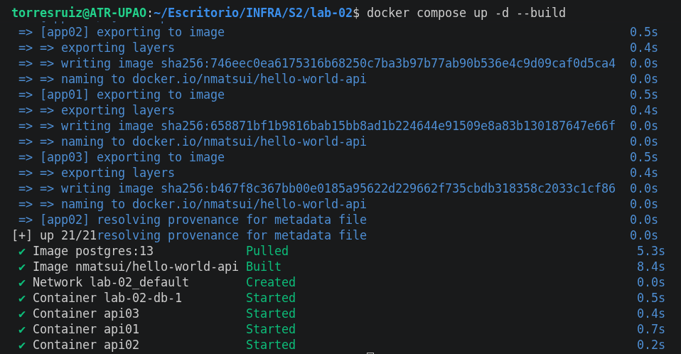
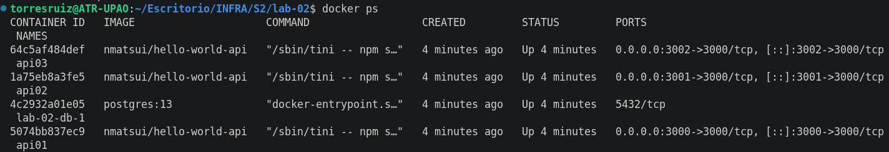
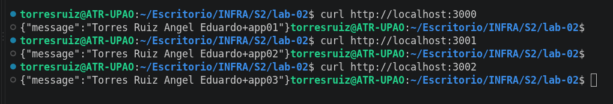
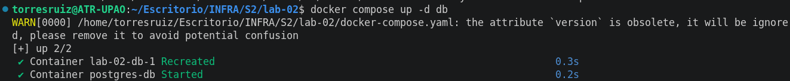
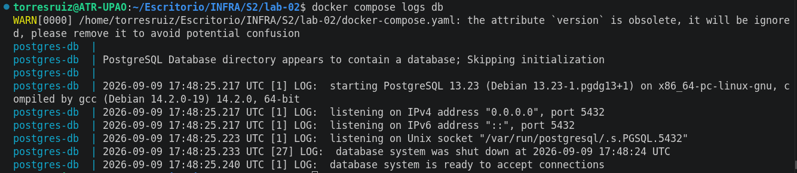

# Laboratorio 02
Hoy utlizaremos docker compose para poder desplegar un servicio web y una base de datos

# STACK Tecnico
## API
- Aplicación JAVA dockerizarla (crear la imagen)
- docker pull nmatsui/hello-world-api
- clever_montalcini 3001
- condescending_davinci 3000
- $ docker run -d --rm -p 3000:3000 nmatsui/hello-world-api
-
## BD PostgreSQL
docker run --name some-postgres -e POSTGRES_PASSWORD=mysecretpassword -d postgres
# COMANDOS
Deben especificar los comandos que voy a ejecutar
## Levantar un contenedor
```bash
docker compose up -d
```
## Dar de baja a un contenedor
```bash
docker compose stop db
```
## Dar de baja a todos los contendores
```bash
docker compose down
```
## Dar de baja a un contenedor

# CONFIGURACIONES
Se necesita crear un .env guiado del .env.example
```
VAR=VALUE
```
# Actividad
Trabajar un docker compose, especificando configuración y comandos para despliegue.
Debe permitir lo siguiente:
- 3 copias de una API build local




- Configuración BD


- Uso de volúmenes
- Uso de variables de entorno
- En README. Responder los tipos de redes y los tipos de volumen que existen en
docker
- Hacer uso de Conventional Commits
- Repositorio publico
- Uso de .gitignore
- Opcional: Capturas de su proyecto desplegado