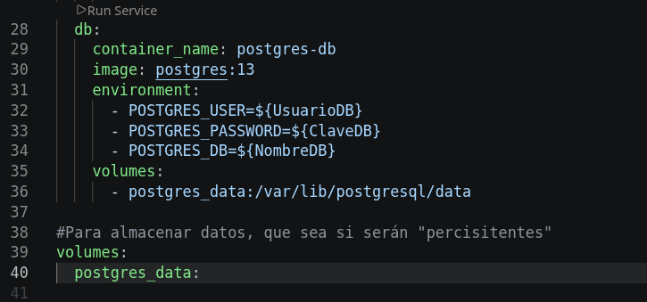
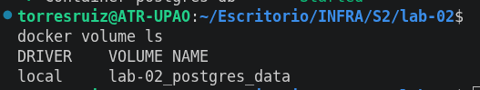
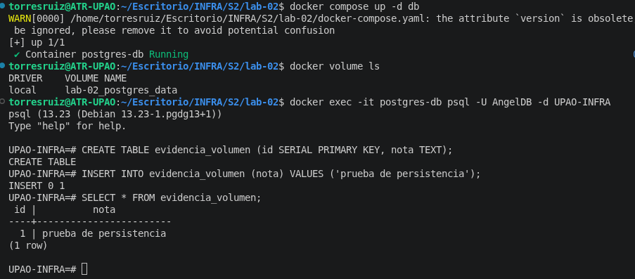
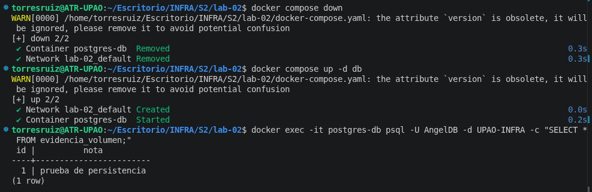
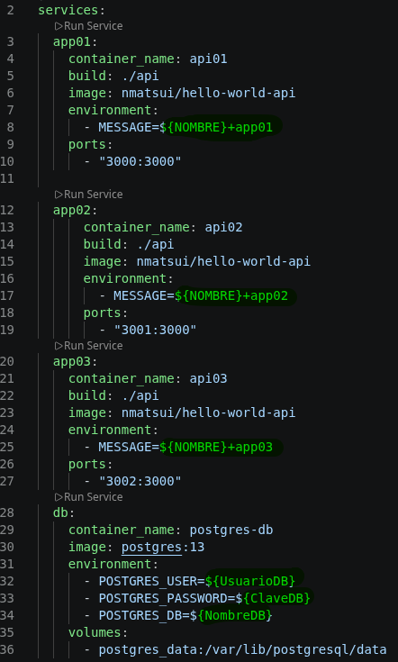
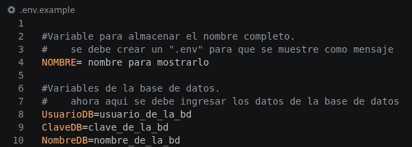
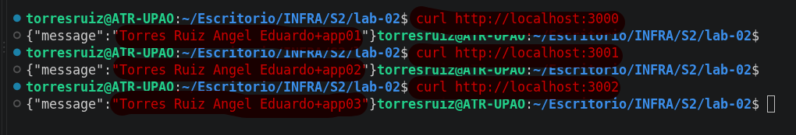

# Laboratorio 02
Hoy utlizaremos docker compose para poder desplegar un servicio web y una base de datos

# STACK Tecnico
## API
- Aplicación JAVA dockerizarla (crear la imagen)
- docker pull nmatsui/hello-world-api
- clever_montalcini 3001
- condescending_davinci 3000
- $ docker run -d --rm -p 3000:3000 nmatsui/hello-world-api
-
## BD PostgreSQL
docker run --name some-postgres -e POSTGRES_PASSWORD=mysecretpassword -d postgres
# COMANDOS
Deben especificar los comandos que voy a ejecutar
## Levantar un contenedor
```bash
docker compose up -d
```
## Dar de baja a un contenedor
```bash
docker compose stop db
```
## Dar de baja a todos los contendores
```bash
docker compose down
```

# CONFIGURACIONES
Se necesita crear un .env guiado del .env.example
```
VAR=VALUE
```
# Actividad
Trabajar un docker compose, especificando configuración y comandos para despliegue.

Debe permitir lo siguiente:

- 3 copias de una API build local


- Configuración BD


- Uso de volúmenes






- Aqui vemos que aun se mantienen, tras abaje bajado y subido el docker


- En README. Responder los tipos de redes y los tipos de volumen que existen en docker
    - Redes:
        -
        - bridge: es la configración por defecto. Donde los contenedores estan en el mismo entorno aislado.
        - host: es un contenedor usa la red de la misma computadora.
        - none: contenedor aislado en su totalidad, sin intenet ni a otros contenedores.
        - overlay: conecta contenedores entre varios servidores distintos.
        - macvlan: da al contenedor su propia IP real, haciendolo parecer a un modem.

    - Volúmenes:
        - 
        - Named volumenes: los administra de manera segura y para que las BD no pierda su información.
        - Bind mounts: vincula una carpeta al contenedor.
        - tmpfs mounts: usa  la memoria RAM para guardar diferentes archivos, y al apagar el contenedor todo desaparece.
- Uso de variables de entorno




- Hacer uso de Conventional Commits
- Repositorio publico
- Uso de .gitignore
- Opcional: Capturas de su proyecto desplegado